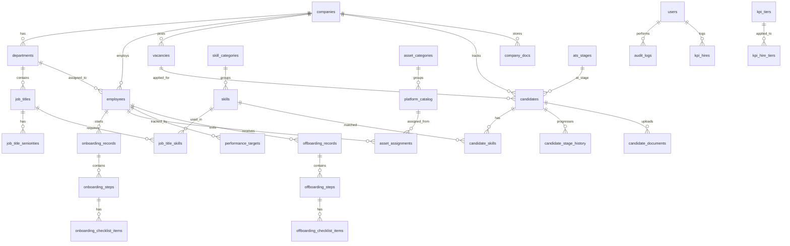

# Database Schema — MySQL

> **Host**: 147.93.27.94:5458
> **Database**: default
> **Engine**: MySQL

---

## Entity Relationship Diagram



---

## Tables

### 1. `companies` — Business Entities

```sql
CREATE TABLE companies (
    id              INT AUTO_INCREMENT PRIMARY KEY,
    name            VARCHAR(255) NOT NULL,
    short_code      VARCHAR(10) NOT NULL UNIQUE,
    logo            LONGTEXT NULL,                    -- Base64 or URL
    address         TEXT NULL,
    phone           VARCHAR(50) NULL,
    email           VARCHAR(255) NULL,
    website         VARCHAR(255) NULL,
    currency        VARCHAR(10) NOT NULL DEFAULT 'AED',
    industry        VARCHAR(100) NULL,
    crm_platform    VARCHAR(100) NULL,
    color_primary   VARCHAR(20) DEFAULT '#6D28D9',
    color_secondary VARCHAR(20) DEFAULT '#1D1245',
    status          ENUM('Active', 'Inactive') DEFAULT 'Active',
    created_at      TIMESTAMP DEFAULT CURRENT_TIMESTAMP,
    updated_at      TIMESTAMP DEFAULT CURRENT_TIMESTAMP ON UPDATE CURRENT_TIMESTAMP
);
```

### 2. `departments`

```sql
CREATE TABLE departments (
    id              INT AUTO_INCREMENT PRIMARY KEY,
    company_id      INT NOT NULL,
    name            VARCHAR(255) NOT NULL,
    description     TEXT NULL,
    head_count_limit INT NULL,
    parent_dept_id  INT NULL,
    icon            VARCHAR(10) DEFAULT '📁',
    sort_order      INT DEFAULT 0,
    status          ENUM('Active', 'Inactive') DEFAULT 'Active',
    created_at      TIMESTAMP DEFAULT CURRENT_TIMESTAMP,
    FOREIGN KEY (company_id) REFERENCES companies(id) ON DELETE CASCADE,
    FOREIGN KEY (parent_dept_id) REFERENCES departments(id) ON DELETE SET NULL,
    UNIQUE KEY uq_dept_company (company_id, name)
);
```

### 3. `job_titles`

```sql
CREATE TABLE job_titles (
    id              INT AUTO_INCREMENT PRIMARY KEY,
    department_id   INT NOT NULL,
    company_id      INT NOT NULL,
    title           VARCHAR(255) NOT NULL,
    description     TEXT NULL,
    status          ENUM('Active', 'Inactive') DEFAULT 'Active',
    created_at      TIMESTAMP DEFAULT CURRENT_TIMESTAMP,
    FOREIGN KEY (department_id) REFERENCES departments(id) ON DELETE CASCADE,
    FOREIGN KEY (company_id) REFERENCES companies(id) ON DELETE CASCADE
);
```

### 4. `job_title_seniorities`

```sql
CREATE TABLE job_title_seniorities (
    id              INT AUTO_INCREMENT PRIMARY KEY,
    job_title_id    INT NOT NULL,
    level           VARCHAR(50) NOT NULL,            -- Junior, Mid, Senior, Lead
    salary_min      DECIMAL(12, 2) NULL,
    salary_max      DECIMAL(12, 2) NULL,
    FOREIGN KEY (job_title_id) REFERENCES job_titles(id) ON DELETE CASCADE
);
```

### 5. `skill_categories`

```sql
CREATE TABLE skill_categories (
    id              INT AUTO_INCREMENT PRIMARY KEY,
    name            VARCHAR(255) NOT NULL,
    icon            VARCHAR(10) DEFAULT '🎯',
    color           VARCHAR(20) DEFAULT '#6D28D9',
    sort_order      INT DEFAULT 0,
    status          ENUM('Active', 'Archived') DEFAULT 'Active',
    created_at      TIMESTAMP DEFAULT CURRENT_TIMESTAMP
);
```

### 6. `skills`

```sql
CREATE TABLE skills (
    id              INT AUTO_INCREMENT PRIMARY KEY,
    category_id     INT NOT NULL,
    name            VARCHAR(255) NOT NULL,
    status          ENUM('Active', 'Archived') DEFAULT 'Active',
    FOREIGN KEY (category_id) REFERENCES skill_categories(id) ON DELETE CASCADE,
    UNIQUE KEY uq_skill_name (category_id, name)
);
```

### 7. `job_title_skills` (junction)

```sql
CREATE TABLE job_title_skills (
    job_title_id    INT NOT NULL,
    skill_id        INT NOT NULL,
    is_required     BOOLEAN DEFAULT TRUE,
    PRIMARY KEY (job_title_id, skill_id),
    FOREIGN KEY (job_title_id) REFERENCES job_titles(id) ON DELETE CASCADE,
    FOREIGN KEY (skill_id) REFERENCES skills(id) ON DELETE CASCADE
);
```

### 8. `vacancies`

```sql
CREATE TABLE vacancies (
    id              INT AUTO_INCREMENT PRIMARY KEY,
    title           VARCHAR(255) NOT NULL,
    company_id      INT NOT NULL,
    department_id   INT NULL,
    job_title_id    INT NULL,
    head_count      INT DEFAULT 1,
    status          ENUM('Draft', 'Open', 'On Hold', 'Closed') DEFAULT 'Draft',
    description     TEXT NULL,
    requirements    TEXT NULL,
    created_by      INT NULL,
    created_at      TIMESTAMP DEFAULT CURRENT_TIMESTAMP,
    updated_at      TIMESTAMP DEFAULT CURRENT_TIMESTAMP ON UPDATE CURRENT_TIMESTAMP,
    closed_at       TIMESTAMP NULL,
    FOREIGN KEY (company_id) REFERENCES companies(id) ON DELETE CASCADE,
    FOREIGN KEY (department_id) REFERENCES departments(id) ON DELETE SET NULL,
    FOREIGN KEY (job_title_id) REFERENCES job_titles(id) ON DELETE SET NULL,
    FOREIGN KEY (created_by) REFERENCES users(id) ON DELETE SET NULL
);
```

### 9. `ats_stages` — Configurable Pipeline

```sql
CREATE TABLE ats_stages (
    id              INT AUTO_INCREMENT PRIMARY KEY,
    name            VARCHAR(100) NOT NULL,
    color           VARCHAR(20) DEFAULT '#EDE9FE',
    text_color      VARCHAR(20) DEFAULT '#5B21B6',
    sort_order      INT NOT NULL,
    is_success      BOOLEAN DEFAULT FALSE,           -- Triggers employee creation
    is_fail         BOOLEAN DEFAULT FALSE,           -- Marks candidate as failed
    is_default      BOOLEAN DEFAULT FALSE,           -- Default stage for new candidates
    status          ENUM('Active', 'Inactive') DEFAULT 'Active'
);
```

### 10. `candidates`

```sql
CREATE TABLE candidates (
    id              INT AUTO_INCREMENT PRIMARY KEY,
    first_name      VARCHAR(100) NOT NULL,
    last_name       VARCHAR(100) NOT NULL,
    email           VARCHAR(255) NULL,
    phone           VARCHAR(50) NULL,
    nationality     VARCHAR(100) NULL,
    score           TINYINT DEFAULT 0,               -- 1-5 rating
    vacancy_id      INT NULL,
    company_id      INT NOT NULL,
    current_stage_id INT NULL,
    notes           TEXT NULL,
    applied_date    DATE NULL,
    status          ENUM('Active', 'Hired', 'Failed', 'Blacklisted') DEFAULT 'Active',
    cv_text         LONGTEXT NULL,                   -- Parsed CV text for AI scoring
    cv_file_name    VARCHAR(255) NULL,
    ai_score        DECIMAL(5, 2) NULL,              -- DeepSeek AI score
    ai_analysis     JSON NULL,                       -- DeepSeek AI detailed analysis
    created_at      TIMESTAMP DEFAULT CURRENT_TIMESTAMP,
    updated_at      TIMESTAMP DEFAULT CURRENT_TIMESTAMP ON UPDATE CURRENT_TIMESTAMP,
    FOREIGN KEY (vacancy_id) REFERENCES vacancies(id) ON DELETE SET NULL,
    FOREIGN KEY (company_id) REFERENCES companies(id) ON DELETE CASCADE,
    FOREIGN KEY (current_stage_id) REFERENCES ats_stages(id) ON DELETE SET NULL
);
```

### 11. `candidate_skills` (junction)

```sql
CREATE TABLE candidate_skills (
    candidate_id    INT NOT NULL,
    skill_id        INT NOT NULL,
    proficiency     ENUM('Beginner', 'Intermediate', 'Advanced', 'Expert') DEFAULT 'Intermediate',
    PRIMARY KEY (candidate_id, skill_id),
    FOREIGN KEY (candidate_id) REFERENCES candidates(id) ON DELETE CASCADE,
    FOREIGN KEY (skill_id) REFERENCES skills(id) ON DELETE CASCADE
);
```

### 12. `candidate_stage_history`

```sql
CREATE TABLE candidate_stage_history (
    id              INT AUTO_INCREMENT PRIMARY KEY,
    candidate_id    INT NOT NULL,
    stage_id        INT NOT NULL,
    moved_by        INT NULL,
    notes           TEXT NULL,
    moved_at        TIMESTAMP DEFAULT CURRENT_TIMESTAMP,
    FOREIGN KEY (candidate_id) REFERENCES candidates(id) ON DELETE CASCADE,
    FOREIGN KEY (stage_id) REFERENCES ats_stages(id) ON DELETE CASCADE,
    FOREIGN KEY (moved_by) REFERENCES users(id) ON DELETE SET NULL
);
```

### 13. `candidate_documents`

```sql
CREATE TABLE candidate_documents (
    id              INT AUTO_INCREMENT PRIMARY KEY,
    candidate_id    INT NOT NULL,
    file_name       VARCHAR(255) NOT NULL,
    file_type       VARCHAR(100) NULL,
    file_size       INT NULL,
    file_data       LONGBLOB NULL,                   -- Binary file storage
    doc_type        ENUM('CV', 'ID', 'Certificate', 'Other') DEFAULT 'CV',
    uploaded_at     TIMESTAMP DEFAULT CURRENT_TIMESTAMP,
    FOREIGN KEY (candidate_id) REFERENCES candidates(id) ON DELETE CASCADE
);
```

### 14. `employees`

```sql
CREATE TABLE employees (
    id              INT AUTO_INCREMENT PRIMARY KEY,
    candidate_id    INT NULL,                        -- Link to original candidate
    first_name      VARCHAR(100) NOT NULL,
    last_name       VARCHAR(100) NOT NULL,
    email           VARCHAR(255) NULL,
    phone           VARCHAR(50) NULL,
    nationality     VARCHAR(100) NULL,
    company_id      INT NOT NULL,
    department_id   INT NULL,
    job_title_id    INT NULL,
    job_title_text  VARCHAR(255) NULL,               -- Denormalized for display
    start_date      DATE NULL,
    end_date        DATE NULL,
    basic_salary    DECIMAL(12, 2) NULL,
    full_salary     DECIMAL(12, 2) NULL,
    status          ENUM('Onboarding', 'Active', 'Offboarding', 'Exited') DEFAULT 'Onboarding',
    created_at      TIMESTAMP DEFAULT CURRENT_TIMESTAMP,
    updated_at      TIMESTAMP DEFAULT CURRENT_TIMESTAMP ON UPDATE CURRENT_TIMESTAMP,
    FOREIGN KEY (candidate_id) REFERENCES candidates(id) ON DELETE SET NULL,
    FOREIGN KEY (company_id) REFERENCES companies(id) ON DELETE CASCADE,
    FOREIGN KEY (department_id) REFERENCES departments(id) ON DELETE SET NULL,
    FOREIGN KEY (job_title_id) REFERENCES job_titles(id) ON DELETE SET NULL
);
```

### 15. `onboarding_records`

```sql
CREATE TABLE onboarding_records (
    id              INT AUTO_INCREMENT PRIMARY KEY,
    employee_id     INT NOT NULL,
    company_id      INT NOT NULL,
    status          ENUM('In Progress', 'Completed', 'Cancelled') DEFAULT 'In Progress',
    started_at      TIMESTAMP DEFAULT CURRENT_TIMESTAMP,
    completed_at    TIMESTAMP NULL,
    FOREIGN KEY (employee_id) REFERENCES employees(id) ON DELETE CASCADE,
    FOREIGN KEY (company_id) REFERENCES companies(id) ON DELETE CASCADE
);
```

### 16. `onboarding_steps`

```sql
CREATE TABLE onboarding_steps (
    id              INT AUTO_INCREMENT PRIMARY KEY,
    onboarding_id   INT NOT NULL,
    step_number     INT NOT NULL,
    name            VARCHAR(255) NOT NULL,
    owner           VARCHAR(100) NULL,
    sla             VARCHAR(100) NULL,
    status          ENUM('Locked', 'Open', 'Complete') DEFAULT 'Locked',
    notes           TEXT NULL,
    opened_at       TIMESTAMP NULL,
    completed_at    TIMESTAMP NULL,
    FOREIGN KEY (onboarding_id) REFERENCES onboarding_records(id) ON DELETE CASCADE
);
```

### 17. `onboarding_checklist_items`

```sql
CREATE TABLE onboarding_checklist_items (
    id              INT AUTO_INCREMENT PRIMARY KEY,
    step_id         INT NOT NULL,
    label           VARCHAR(500) NOT NULL,
    is_checked      BOOLEAN DEFAULT FALSE,
    sort_order      INT DEFAULT 0,
    checked_at      TIMESTAMP NULL,
    FOREIGN KEY (step_id) REFERENCES onboarding_steps(id) ON DELETE CASCADE
);
```

### 18. `asset_categories`

```sql
CREATE TABLE asset_categories (
    id              INT AUTO_INCREMENT PRIMARY KEY,
    name            VARCHAR(255) NOT NULL,
    icon            VARCHAR(10) DEFAULT '💻',
    color           VARCHAR(20) DEFAULT '#374151',
    sort_order      INT DEFAULT 0
);
```

### 19. `platform_catalog`

```sql
CREATE TABLE platform_catalog (
    id              INT AUTO_INCREMENT PRIMARY KEY,
    category_id     INT NOT NULL,
    name            VARCHAR(255) NOT NULL,
    asset_type      ENUM('Hardware', 'Account', 'Software') DEFAULT 'Account',
    description     TEXT NULL,
    inventory_total INT DEFAULT 0,
    status          ENUM('Active', 'Inactive') DEFAULT 'Active',
    FOREIGN KEY (category_id) REFERENCES asset_categories(id) ON DELETE CASCADE
);
```

### 20. `platform_companies` (junction — which companies use which platform)

```sql
CREATE TABLE platform_companies (
    platform_id     INT NOT NULL,
    company_id      INT NOT NULL,
    PRIMARY KEY (platform_id, company_id),
    FOREIGN KEY (platform_id) REFERENCES platform_catalog(id) ON DELETE CASCADE,
    FOREIGN KEY (company_id) REFERENCES companies(id) ON DELETE CASCADE
);
```

### 21. `asset_assignments`

```sql
CREATE TABLE asset_assignments (
    id              INT AUTO_INCREMENT PRIMARY KEY,
    employee_id     INT NOT NULL,
    platform_id     INT NULL,
    company_id      INT NOT NULL,
    name            VARCHAR(255) NOT NULL,
    asset_type      ENUM('Hardware', 'Account', 'Software') DEFAULT 'Account',
    workspace       VARCHAR(255) NULL,
    access_level    VARCHAR(100) NULL,
    identifier      VARCHAR(255) NULL,
    issued_date     DATE NULL,
    expected_return DATE NULL,
    returned_date   DATE NULL,
    status          ENUM('Active', 'Returned', 'Deactivated', 'Missing') DEFAULT 'Active',
    condition_note  VARCHAR(100) NULL,               -- Good/Damaged/Missing
    notes           TEXT NULL,
    created_at      TIMESTAMP DEFAULT CURRENT_TIMESTAMP,
    FOREIGN KEY (employee_id) REFERENCES employees(id) ON DELETE CASCADE,
    FOREIGN KEY (platform_id) REFERENCES platform_catalog(id) ON DELETE SET NULL,
    FOREIGN KEY (company_id) REFERENCES companies(id) ON DELETE CASCADE
);
```

### 22. `performance_targets`

```sql
CREATE TABLE performance_targets (
    id              INT AUTO_INCREMENT PRIMARY KEY,
    employee_id     INT NOT NULL,
    company_id      INT NOT NULL,
    quarter         VARCHAR(10) NOT NULL,            -- e.g., "Q2-2026"
    target_amount   DECIMAL(12, 2) NULL,
    currency        VARCHAR(10) DEFAULT 'AED',
    kpi_notes       TEXT NULL,
    status          ENUM('Active', 'Inactive') DEFAULT 'Active',
    signed_at       TIMESTAMP NULL,
    created_at      TIMESTAMP DEFAULT CURRENT_TIMESTAMP,
    FOREIGN KEY (employee_id) REFERENCES employees(id) ON DELETE CASCADE,
    FOREIGN KEY (company_id) REFERENCES companies(id) ON DELETE CASCADE
);
```

### 23. `offboarding_records`

```sql
CREATE TABLE offboarding_records (
    id              INT AUTO_INCREMENT PRIMARY KEY,
    employee_id     INT NOT NULL,
    company_id      INT NOT NULL,
    departure_type  ENUM('Resignation', 'Termination', 'End of Contract', 'Mutual Agreement') NOT NULL,
    last_working_day DATE NOT NULL,
    reason          TEXT NULL,
    basic_salary    DECIMAL(12, 2) NULL,
    full_salary     DECIMAL(12, 2) NULL,
    employment_start DATE NULL,
    eosb_amount     DECIMAL(12, 2) NULL,
    leave_encashment DECIMAL(12, 2) NULL,
    deductions      DECIMAL(12, 2) DEFAULT 0,
    total_settlement DECIMAL(12, 2) NULL,
    status          ENUM('In Progress', 'Completed', 'Cancelled') DEFAULT 'In Progress',
    started_at      TIMESTAMP DEFAULT CURRENT_TIMESTAMP,
    completed_at    TIMESTAMP NULL,
    FOREIGN KEY (employee_id) REFERENCES employees(id) ON DELETE CASCADE,
    FOREIGN KEY (company_id) REFERENCES companies(id) ON DELETE CASCADE
);
```

### 24. `offboarding_steps`

```sql
CREATE TABLE offboarding_steps (
    id              INT AUTO_INCREMENT PRIMARY KEY,
    offboarding_id  INT NOT NULL,
    step_number     INT NOT NULL,
    name            VARCHAR(255) NOT NULL,
    owner           VARCHAR(100) NULL,
    sla             VARCHAR(100) NULL,
    status          ENUM('Locked', 'Open', 'Complete') DEFAULT 'Locked',
    notes           TEXT NULL,
    opened_at       TIMESTAMP NULL,
    completed_at    TIMESTAMP NULL,
    FOREIGN KEY (offboarding_id) REFERENCES offboarding_records(id) ON DELETE CASCADE
);
```

### 25. `offboarding_checklist_items`

```sql
CREATE TABLE offboarding_checklist_items (
    id              INT AUTO_INCREMENT PRIMARY KEY,
    step_id         INT NOT NULL,
    label           VARCHAR(500) NOT NULL,
    is_checked      BOOLEAN DEFAULT FALSE,
    sort_order      INT DEFAULT 0,
    checked_at      TIMESTAMP NULL,
    FOREIGN KEY (step_id) REFERENCES offboarding_steps(id) ON DELETE CASCADE
);
```

### 26. `users`

```sql
CREATE TABLE users (
    id              INT AUTO_INCREMENT PRIMARY KEY,
    username        VARCHAR(100) NOT NULL UNIQUE,
    password_hash   VARCHAR(255) NOT NULL,           -- bcrypt hash
    name            VARCHAR(255) NOT NULL,
    email           VARCHAR(255) NULL,
    role            ENUM('admin', 'hr_manager', 'recruiter', 'employee') DEFAULT 'employee',
    company_id      INT NULL,                        -- NULL = ALL companies
    is_active       BOOLEAN DEFAULT TRUE,
    last_login_at   TIMESTAMP NULL,
    created_at      TIMESTAMP DEFAULT CURRENT_TIMESTAMP,
    updated_at      TIMESTAMP DEFAULT CURRENT_TIMESTAMP ON UPDATE CURRENT_TIMESTAMP,
    FOREIGN KEY (company_id) REFERENCES companies(id) ON DELETE SET NULL
);
```

### 27. `audit_logs`

```sql
CREATE TABLE audit_logs (
    id              INT AUTO_INCREMENT PRIMARY KEY,
    user_id         INT NULL,
    user_name       VARCHAR(255) NOT NULL,
    module          VARCHAR(100) NOT NULL,
    action          VARCHAR(100) NOT NULL,
    detail          TEXT NULL,
    ip_address      VARCHAR(50) NULL,
    created_at      TIMESTAMP DEFAULT CURRENT_TIMESTAMP,
    FOREIGN KEY (user_id) REFERENCES users(id) ON DELETE SET NULL,
    INDEX idx_audit_module (module),
    INDEX idx_audit_created (created_at)
);
```

### 28. `kpi_tiers`

```sql
CREATE TABLE kpi_tiers (
    id              INT AUTO_INCREMENT PRIMARY KEY,
    name            VARCHAR(255) NOT NULL,
    label           VARCHAR(255) NOT NULL,
    amount          DECIMAL(10, 2) NOT NULL,
    currency        VARCHAR(10) DEFAULT 'AED',
    icon            VARCHAR(10) DEFAULT '🏅',
    criteria        TEXT NULL,
    sort_order      INT DEFAULT 0
);
```

### 29. `kpi_targets`

```sql
CREATE TABLE kpi_targets (
    id              INT AUTO_INCREMENT PRIMARY KEY,
    name            VARCHAR(255) NOT NULL,
    target_value    DECIMAL(10, 2) NOT NULL,
    unit            VARCHAR(50) NOT NULL,
    sort_order      INT DEFAULT 0
);
```

### 30. `kpi_hires`

```sql
CREATE TABLE kpi_hires (
    id              INT AUTO_INCREMENT PRIMARY KEY,
    employee_name   VARCHAR(255) NOT NULL,
    role            VARCHAR(255) NULL,
    company_id      INT NOT NULL,
    join_date       DATE NOT NULL,
    commission      DECIMAL(10, 2) DEFAULT 0,
    status          ENUM('Pending', 'Confirmed') DEFAULT 'Pending',
    notes           TEXT NULL,
    created_by      INT NULL,
    created_at      TIMESTAMP DEFAULT CURRENT_TIMESTAMP,
    FOREIGN KEY (company_id) REFERENCES companies(id) ON DELETE CASCADE,
    FOREIGN KEY (created_by) REFERENCES users(id) ON DELETE SET NULL
);
```

### 31. `kpi_hire_tiers` (junction)

```sql
CREATE TABLE kpi_hire_tiers (
    kpi_hire_id     INT NOT NULL,
    kpi_tier_id     INT NOT NULL,
    PRIMARY KEY (kpi_hire_id, kpi_tier_id),
    FOREIGN KEY (kpi_hire_id) REFERENCES kpi_hires(id) ON DELETE CASCADE,
    FOREIGN KEY (kpi_tier_id) REFERENCES kpi_tiers(id) ON DELETE CASCADE
);
```

### 32. `company_documents`

```sql
CREATE TABLE company_documents (
    id              INT AUTO_INCREMENT PRIMARY KEY,
    company_id      INT NOT NULL,
    category        VARCHAR(100) NOT NULL,
    file_name       VARCHAR(255) NOT NULL,
    file_type       VARCHAR(100) NULL,
    file_size       INT NULL,
    file_data       LONGBLOB NULL,
    uploaded_by     INT NULL,
    uploaded_at     TIMESTAMP DEFAULT CURRENT_TIMESTAMP,
    FOREIGN KEY (company_id) REFERENCES companies(id) ON DELETE CASCADE,
    FOREIGN KEY (uploaded_by) REFERENCES users(id) ON DELETE SET NULL,
    INDEX idx_docs_company_cat (company_id, category)
);
```

### 33. `letter_templates`

```sql
CREATE TABLE letter_templates (
    id              INT AUTO_INCREMENT PRIMARY KEY,
    type            VARCHAR(50) NOT NULL,            -- warning, termination, offer, etc.
    name            VARCHAR(255) NOT NULL,
    icon            VARCHAR(10) DEFAULT '📄',
    fields_config   JSON NOT NULL,                   -- Dynamic form fields definition
    body_template   LONGTEXT NOT NULL,               -- HTML template with {{placeholders}}
    sort_order      INT DEFAULT 0,
    status          ENUM('Active', 'Inactive') DEFAULT 'Active'
);
```

### 34. `generated_letters`

```sql
CREATE TABLE generated_letters (
    id              INT AUTO_INCREMENT PRIMARY KEY,
    template_id     INT NULL,
    company_id      INT NOT NULL,
    letter_type     VARCHAR(50) NOT NULL,
    recipient_name  VARCHAR(255) NOT NULL,
    field_values    JSON NOT NULL,                   -- All filled form values
    rendered_html   LONGTEXT NULL,                   -- Final rendered letter
    generated_by    INT NULL,
    generated_at    TIMESTAMP DEFAULT CURRENT_TIMESTAMP,
    FOREIGN KEY (template_id) REFERENCES letter_templates(id) ON DELETE SET NULL,
    FOREIGN KEY (company_id) REFERENCES companies(id) ON DELETE CASCADE,
    FOREIGN KEY (generated_by) REFERENCES users(id) ON DELETE SET NULL
);
```

### 35. `onboarding_step_templates`

```sql
CREATE TABLE onboarding_step_templates (
    id              INT AUTO_INCREMENT PRIMARY KEY,
    company_id      INT NOT NULL,
    step_number     INT NOT NULL,
    name            VARCHAR(255) NOT NULL,
    owner           VARCHAR(100) NULL,
    sla             VARCHAR(100) NULL,
    sort_order      INT DEFAULT 0,
    FOREIGN KEY (company_id) REFERENCES companies(id) ON DELETE CASCADE
);
```

### 36. `onboarding_step_template_items`

```sql
CREATE TABLE onboarding_step_template_items (
    id              INT AUTO_INCREMENT PRIMARY KEY,
    template_step_id INT NOT NULL,
    label           VARCHAR(500) NOT NULL,
    sort_order      INT DEFAULT 0,
    FOREIGN KEY (template_step_id) REFERENCES onboarding_step_templates(id) ON DELETE CASCADE
);
```

### 37. `offboarding_step_templates` (same pattern)

```sql
CREATE TABLE offboarding_step_templates (
    id              INT AUTO_INCREMENT PRIMARY KEY,
    company_id      INT NOT NULL,
    departure_type  VARCHAR(50) NULL,                -- NULL = all types
    step_number     INT NOT NULL,
    name            VARCHAR(255) NOT NULL,
    owner           VARCHAR(100) NULL,
    sla             VARCHAR(100) NULL,
    sort_order      INT DEFAULT 0,
    FOREIGN KEY (company_id) REFERENCES companies(id) ON DELETE CASCADE
);
```

### 38. `offboarding_step_template_items`

```sql
CREATE TABLE offboarding_step_template_items (
    id              INT AUTO_INCREMENT PRIMARY KEY,
    template_step_id INT NOT NULL,
    label           VARCHAR(500) NOT NULL,
    sort_order      INT DEFAULT 0,
    FOREIGN KEY (template_step_id) REFERENCES offboarding_step_templates(id) ON DELETE CASCADE
);
```

### 39. `doc_categories`

```sql
CREATE TABLE doc_categories (
    id              INT AUTO_INCREMENT PRIMARY KEY,
    name            VARCHAR(255) NOT NULL,
    slug            VARCHAR(100) NOT NULL UNIQUE,
    icon            VARCHAR(10) DEFAULT '📁',
    color           VARCHAR(20) DEFAULT '#374151',
    bg_color        VARCHAR(20) DEFAULT '#F1F5F9',
    sort_order      INT DEFAULT 0
);
```

### 40. `cv_scorer_profiles`

```sql
CREATE TABLE cv_scorer_profiles (
    id              INT AUTO_INCREMENT PRIMARY KEY,
    title           VARCHAR(255) NOT NULL,
    company_id      INT NULL,
    department      VARCHAR(255) NULL,
    location        VARCHAR(255) NULL,
    employment_type VARCHAR(100) NULL,
    seniority       VARCHAR(100) NULL,
    reports_to      VARCHAR(255) NULL,
    salary_range    VARCHAR(100) NULL,
    min_years_exp   INT DEFAULT 0,
    must_have_skills JSON NULL,
    nice_have_skills JSON NULL,
    required_tools  JSON NULL,
    required_languages JSON NULL,
    required_industries JSON NULL,
    keywords        JSON NULL,
    education_level VARCHAR(50) NULL,
    weights         JSON NULL,                       -- { quality: 10, experience: 30, ... }
    created_by      INT NULL,
    created_at      TIMESTAMP DEFAULT CURRENT_TIMESTAMP,
    FOREIGN KEY (company_id) REFERENCES companies(id) ON DELETE SET NULL,
    FOREIGN KEY (created_by) REFERENCES users(id) ON DELETE SET NULL
);
```

---

## Indexes

```sql
-- Performance indexes
CREATE INDEX idx_candidates_company ON candidates(company_id);
CREATE INDEX idx_candidates_vacancy ON candidates(vacancy_id);
CREATE INDEX idx_candidates_stage ON candidates(current_stage_id);
CREATE INDEX idx_candidates_status ON candidates(status);

CREATE INDEX idx_employees_company ON employees(company_id);
CREATE INDEX idx_employees_status ON employees(status);
CREATE INDEX idx_employees_dept ON employees(department_id);

CREATE INDEX idx_vacancies_company ON vacancies(company_id);
CREATE INDEX idx_vacancies_status ON vacancies(status);

CREATE INDEX idx_assets_employee ON asset_assignments(employee_id);
CREATE INDEX idx_assets_status ON asset_assignments(status);

CREATE INDEX idx_audit_user ON audit_logs(user_id);
CREATE INDEX idx_audit_module_action ON audit_logs(module, action);
```

---

## Table Count: 40 tables
